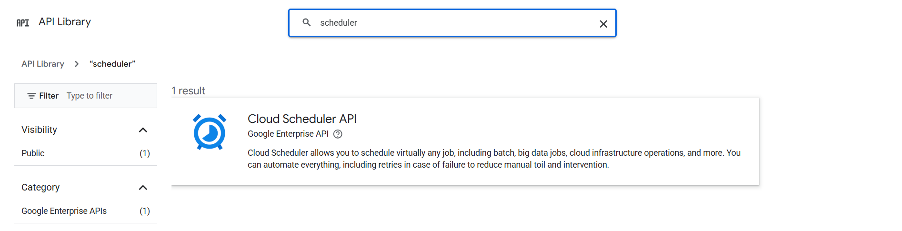
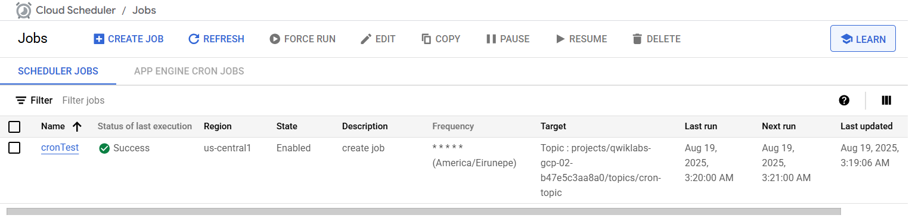

# 🚀 Create Cloud Scheduler

Cloud Scheduler, also known as a **Cron Job**, lets you automate tasks to run at specified intervals. Each cron job created using Cloud Scheduler is sent to a **target**.

### 🎯 Target Types:
- 🌐 Publicly available HTTP/S endpoints
- 📢 Pub/Sub topics
- 🏭 App Engine HTTP/S applications


---

## 🛠️ Enable Cloud Scheduler API

1. Go to **APIs & services** → **Library**
2. In the search bar, type **"scheduler"**
3. Click **Enable** on the Cloud Scheduler API



---

## 🎡 Set up Cloud Pub/Sub

Create a **Pub/Sub topic** to use as a target for your cron job and a **subscription** to receive messages:

```bash
# Create a Pub/Sub topic
gcloud pubsub topics create <Cron-Name>
gcloud pubsub topics create cron-topic

# Create a Pub/Sub subscription
gcloud pubsub subscriptions create <Sub-Name> --topic <Cron-Name>
gcloud pubsub subscriptions create cron-sub --topic cron-topic
```


---

## 📝 Create a Job

1. Go to **Solutions** → **All Products**
2. Search for **"Cloud Scheduler"**
3. Click **Create job**
4. Fill in **Name**, **Region**, **Frequency (CRON format)**, **TimeZone**
5. Select **Target type**: `Pub/Sub topics`
6. Enter your **Message**


After setup, you'll have a job that sends a message to your **Cloud Pub/Sub topic** every minute. Wait a minute or two for the job to succeed!



---

## ✅ Verify the Results in Cloud Pub/Sub

To confirm your Cloud Pub/Sub topic is receiving messages from your job, run:

```bash
gcloud pubsub subscriptions pull cron-sub --limit 5
```


---

> 🎉 Congratulations! You have successfully set up a Cloud Scheduler cron job to automate message delivery to Cloud Pub/Sub!