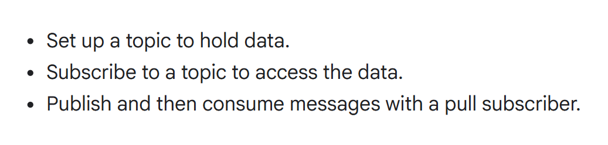
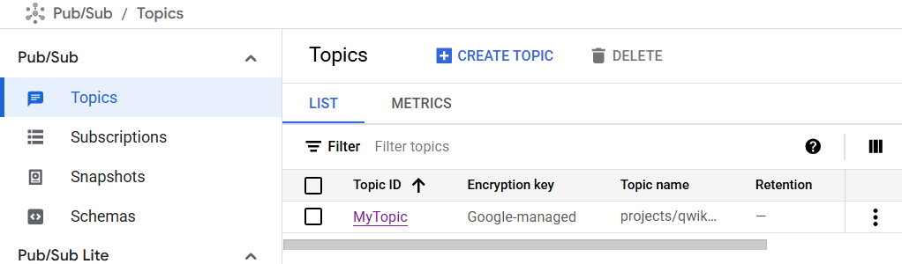
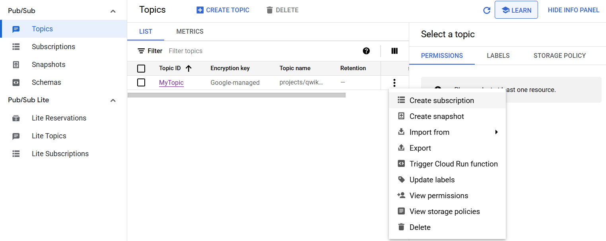
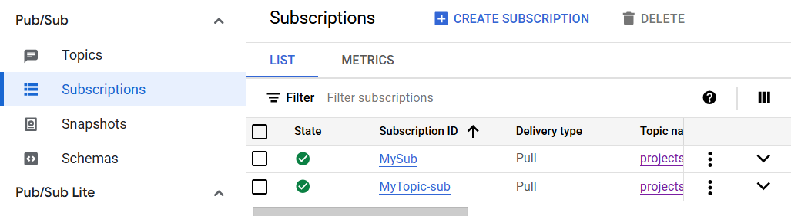
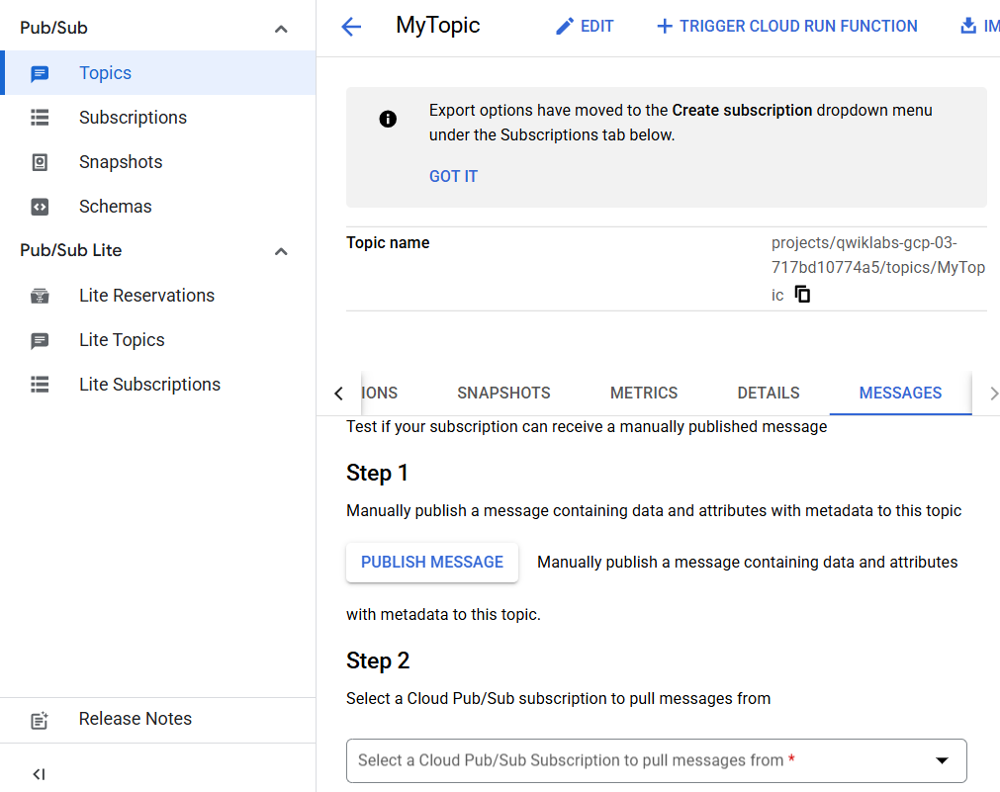
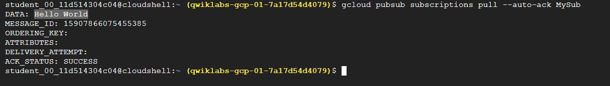
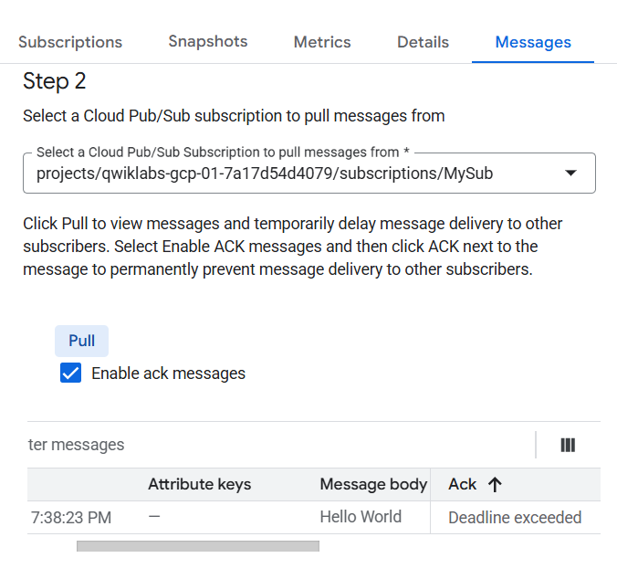

# 🚀 Pub/Sub Guide

Welcome! This README will walk you through the basics of Google Cloud Pub/Sub: creating a topic, publishing messages, setting up subscriptions, and pulling messages.  
Let’s get started! 😃

---

## 🗂️ How Pub/Sub works?

- A publisher sends a message to a topic.
- Pub/Sub service stores and delivers the message.
- Subscribers receive the message via a subscription (either push or pull model).



---

## 📝 Create a Pub/Sub Topic

1. Go to **Solutions → All products → Analytics → Pub/Sub → Topics → Create topic**  
   

---

## ➕ Add a Subscription

1. Click **Create subscription**  
   
2. Choose:
   ```
   Delivery type: Pull
   ```
3. Subscription created!  
   

---

## 📤 Publish a Message

1. Navigate to **pub/sub → Topics → <Topic-Name> → Messages → Publish Message "Hello World" → Publish**  
   

---

## 👀 View (Pull) the Message

**From CLI:**  
```bash
gcloud pubsub subscriptions pull --auto-ack <Sub-Name>
```


**From Console:**  
1. Go to **pub/sub → Topics → Topic-Name → Messages**
2. Select a Cloud Pub/Sub subscription to pull messages
3. Choose subscription, enable "ack", and click **Pull**


---

## 💡 Tips & Best Practices

- 📨 A publisher application creates and sends messages to a **topic**. Subscriber applications create a **subscription** to the topic to receive messages.
- ☁️ Cloud Pub/Sub is an **asynchronous** messaging service designed to be highly reliable and scalable.

---

Happy Messaging! 🎉