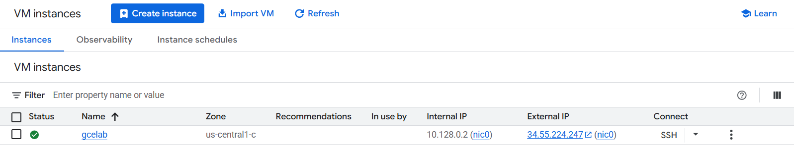
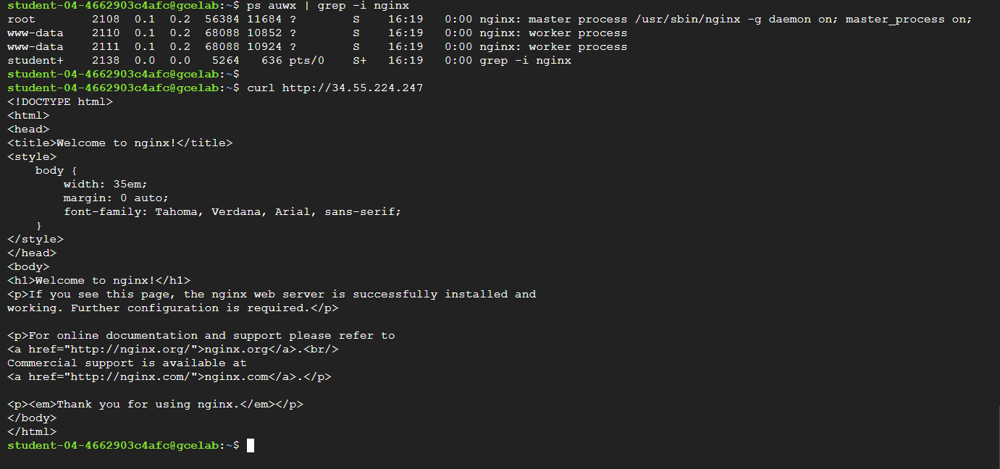
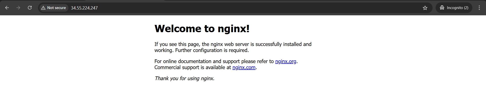
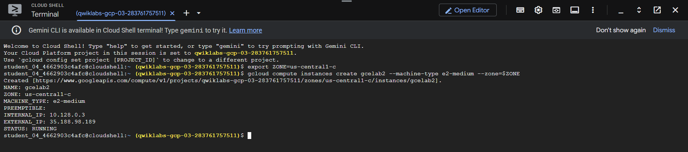
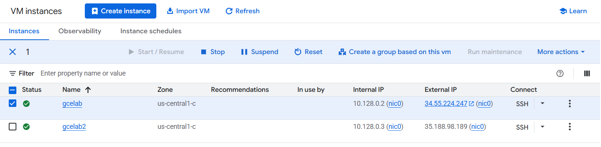

# 🚀 Create VM Machine from Console & CLI

## 🖥️ Create VM Machine from Console

1. Navigate to **Compute Engine** → **VM instances** → **New instance**  
   

2. **Output:**  
   - Allows **SSH** & **HTTP** connections  
   ```bash
   # Commands to install Nginx
   sudo apt-get update
   sudo apt-get install -y nginx

   # Confirm that NGINX is running 
   ps auwx | grep -i nginx

   # Test via external IP
   curl http://External-IP-VM
   ```
   
   

---

## 🧑‍💻 Create VM Machine from CLI

1. **Specify Availability Zone**
   ```bash
   export ZONE=us-central1-c
   ```

2. **Create Instance**
   ```bash
   gcloud compute instances create <Instance-Name> --machine-type e2-medium --zone=$ZONE
   ```
   
   

---

## 💡 Tips

- 🛡️ Make sure your firewall rules allow SSH (port 22) and HTTP (port 80).
- 📝 Replace `External-IP-VM` with your instance's external IP.
- 📦 Nginx is a popular web server—installing it verifies your VM is running and accessible.

---

## 📚 References

- [Google Cloud Compute Engine Docs](https://cloud.google.com/compute/docs/instances)
- [gcloud CLI Documentation](https://cloud.google.com/sdk/gcloud)
