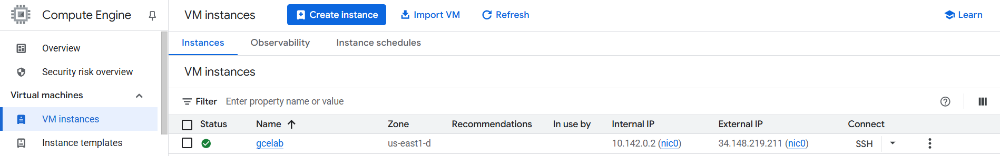
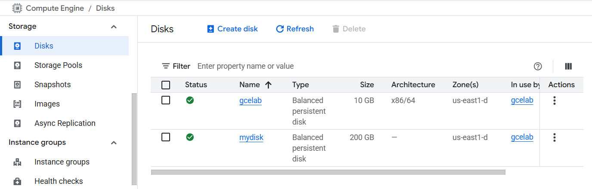
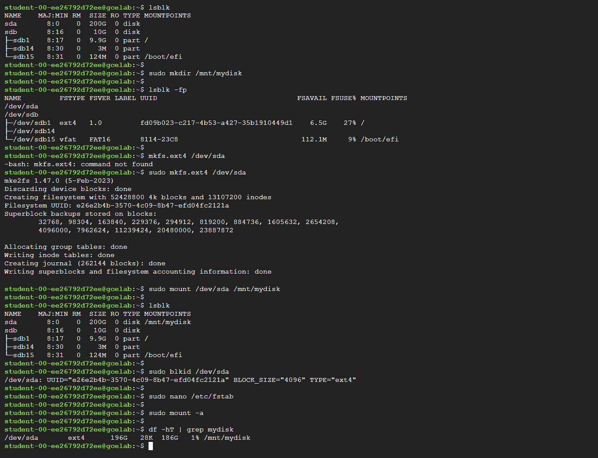
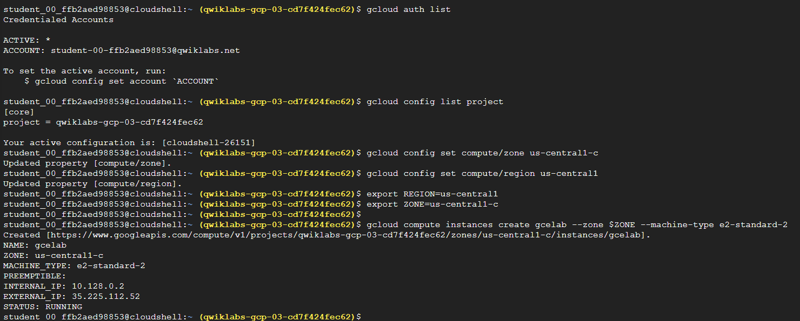
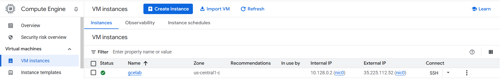
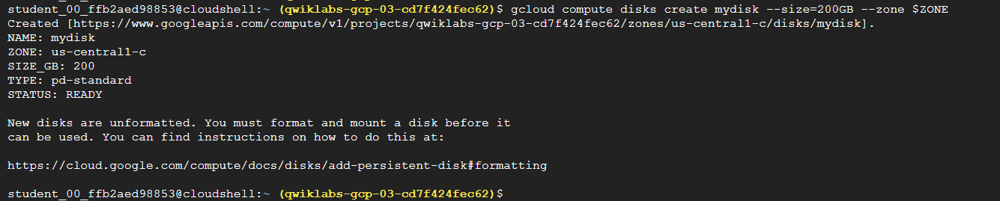
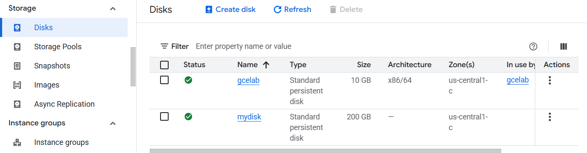
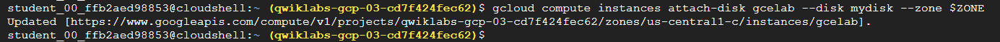
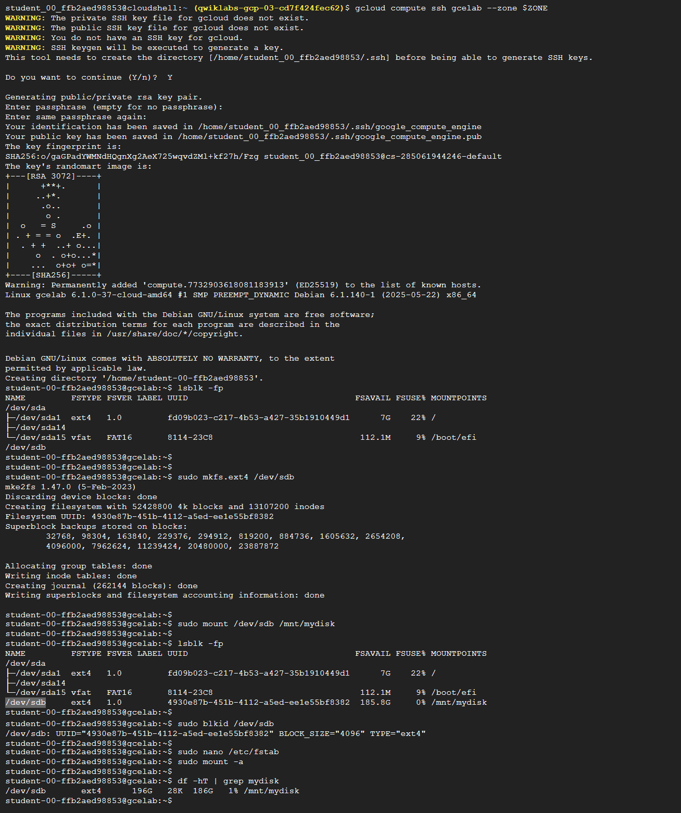

# 🚀 Google Cloud VM & Persistent Disk Setup Guide

This guide walks you through creating and managing **VM instances** and **persistent disks** in Google Cloud, using both the **Console** and **CLI**. You'll find clear steps, handy images, and useful tips! 😃

---

## 🖥️ Create VM Instance & Persistent Disk from Console

### 1️⃣ VM Instance Creation

1. Go to **Compute Engine** 👉 **VM instances** 👉 **Create instance**  
2. Configure your VM settings as needed.

### 2️⃣ Add Persistent Disk

1. In the **Create instance** page, scroll to **OS and Storage**  
2. Click on **Add new Disk** to attach a persistent disk.





---

## 💻 Create VM Instance & Persistent Disk from CLI

### 1️⃣ Set Region & Zone

```bash
gcloud config set compute/zone <Zone>      # Example: us-central1-c
gcloud config set compute/region <Region>  # Example: us-central1

export REGION=<Region>
export ZONE=<Zone>
```

### 2️⃣ Create VM Instance

```bash
gcloud compute instances create <VM-Name> \
  --machine-type e2-standard-2 \
  --zone $ZONE
```



### 3️⃣ Create Persistent Disk

**Types of Persistent Disks:**  
- 💾 Standard persistent disk  
- ⚡ SSD persistent disk

```bash
gcloud compute disks create <Disk-Name> \
  --size=200GB \
  --zone $ZONE
```



### 4️⃣ Attach Disk to VM

```bash
gcloud compute instances attach-disk <VM-Name> \
  --disk <Disk-Name> \
  --zone $ZONE
```


### 5️⃣ Format & Mount Disk in VM

```bash
gcloud compute ssh <VM-Name> --zone $ZONE

# Find Disk Device
lsblk -fp

# Format Disk (example: sdb)
sudo mkfs.ext4 /dev/<disk>

# Mount
sudo mkdir /mnt/mydisk
sudo mount /dev/<disk> /mnt/mydisk

# Automatically mount on restart
sudo blkid /dev/<disk>
sudo nano /etc/fstab

# Apply configuration
sudo mount -a

# Check disk (h=human readable, T=type)
df -hT | grep mydisk
```


---

## 💡 Tips & Best Practices

**Migrating a persistent disk to another region? Perform these steps in order:**

1. ⛔ Unmount file system(s)
2. 📸 Create snapshot
3. 💾 Create disk (in new region)
4. 🖥️ Create instance
5. 🔗 Attach disk

---

> **Need more help?**  
> Check [Google Cloud documentation](https://cloud.google.com/compute/docs/disks) for advanced topics and troubleshooting. 👍
